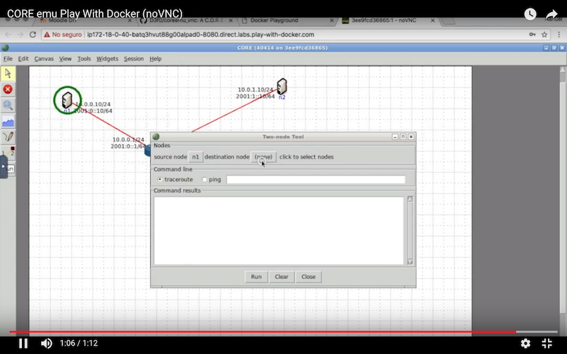

# Imagen de CORE y Jupyter para la cátedra de Redes y Transmisión de Datos


# Sobre el trabajo previo

Inspirada en el trabajo de [Stuart Mardsen](https://github.com/stuartmarsden/dockerCoreEmu) y paquetes de [Eriberto packages](http://eriberto.pro.br/core/
).

Se puede obtener de [Docker Hub](https://hub.docker.com/r/d3f0/coreemu_vnc/)

Provista de VNC y noVNC  (VNC en HTML5).


## Uso

Una vez instalado Docker, ejecutar:

```
docker run -d --hostname coreemu_vnc --name coreemu_vnc --cap-add=NET_ADMIN --cap-add=SYS_ADMIN -p 5901:5900 -p 8080:8080 -p 9999:9999 -v "$(pwd)":/root/shared d3f0/coreemu_vnc
```

Si persisten los problemas de ejecución (Ubuntu 18.04), reemplazar `--cap-add=NET_ADMIN --cap-add=SYS_ADMIN` por `--privileged`.

Alguna funcionalidad de CORE requiere que el anfitrión tenga instalado `ebtables`.

```
apt install ebtables # Ubuntu/Debian
```


## Archivos Compartidos

Con `-v "$(pwd)":/root/shared` se comparte la carpeta actual en /root/shared. 

## Password VNC

La clave para noVNC `coreemu`, pero se puede cambiar con la variable de ambiente `-e PASSWORD=1234`.

## Jupyter

Esta imagen contiene un entorno Notebook/Lab ejecutándose en el puerto 9999.

# Ejecución en PlayWithDocker

[](https://www.youtube.com/watch?v=VuWV9cM-LVg)
