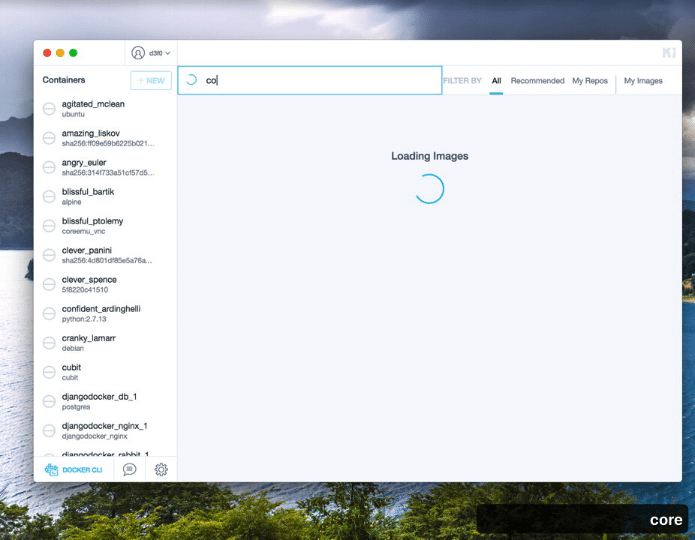
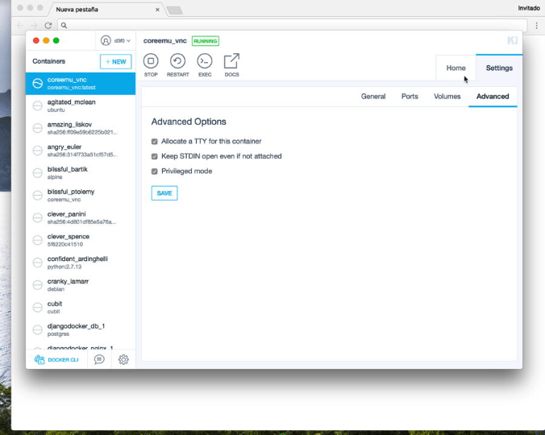
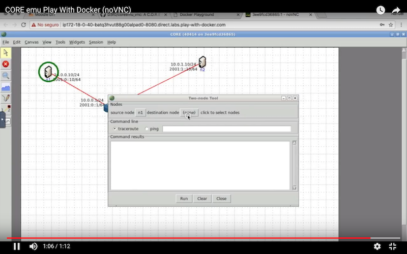

# CORE Network Simulator

[Español](./README.es.md)

This image is an inspirated on the work of [Stuart Mardsen](https://github.com/stuartmarsden/dockerCoreEmu) CORE EMU image and his recommendations on [Eriberto packages](http://eriberto.pro.br/core/
).

It's based, currently, on Ubuntu 17.10. You can get the udpated build at [Docker Hub](https://hub.docker.com/r/d3f0/coreemu_vnc/)

This image serves VNC and noVNC (this requires a modern web browser to be used).


## Usage

Run the image to use it:

```
docker run -d --cap-add=NET_ADMIN --cap-add=SYS_ADMIN -p 5900:5900 -p 8080:8080 d3f0/coreemu_vnc
```

It must be run with `SYS_ADMIN` or it cannot create namespaces within the container which is needed for Core. It requires `NET_ADMIN` to make the internal networks. You can then use a VNC client and connect on `localhost:5900`.

Note some of the functionality in CORE requires ebtables this must be installed in the host machine as well.

```
apt install ebtables # Ubuntu/Debian
```


## Sharing files
There's a volume declared as /root/shared, you can exchange files though that folder.

```
docker run -d --cap-add=NET_ADMIN --cap-add=SYS_ADMIN -v $(pwd)/shared:/root/shared -p 5900:5900 -p 8080:8080 d3f0/coreemu_vnc
```

## Password

The default password is `coreemu`, but it can be changed using `-e PASSWORD=1234`.

## Jupyter

This image also includes a Jupyter Notebook/Lab server (it's installed though pipenv and directly executed with `supervisor.conf`).

To run this image with Jupyter, this is recommended:

```
docker run -d --name=coreemu_vnc --hostname=coreemu_vnc --cap-add=NET_ADMIN --cap-add=SYS_ADMIN -v $(pwd)/shared:/root/shared -p 5900:5900 -p 8080:8080 -p 9999:9999  d3f0/coreemu_vnc
```

# Running in Kitematic

Search the d3f0/coreemu_vnc image and run it in privileged mode, then point a browser to the port Docker expose the container's 8080 port.





# How to run this in [Play With Docker](https://labs.play-with-docker.com)

[](https://www.youtube.com/watch?v=VuWV9cM-LVg)
